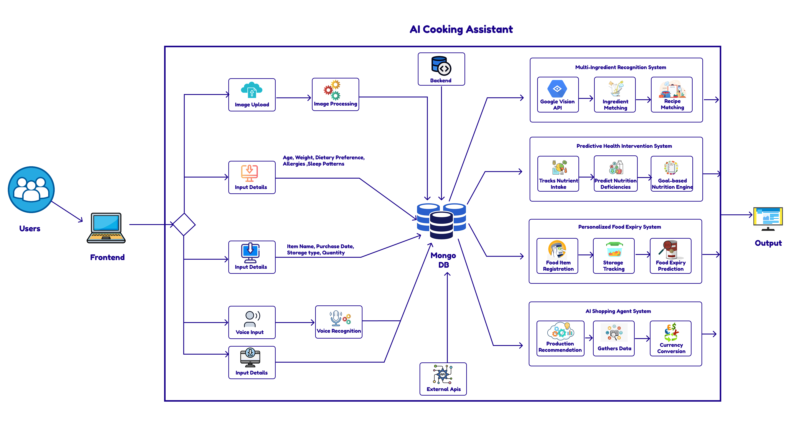

# AI-Powered Kitchen Ecosystem

### Topic: AI-Powered Kitchen Ecosystem for Food Waste Reduction and Nutrition Optimization
### Main Research Domain: CoEAI - Centre of Excellence for AI
### Project ID: 25-26J-351
### Repo Link: https://github.com/MethusalaKPerera/AI-POWERED-KITCHEN-ECHO-SYSTEM.git

**AI-Powered Kitchen Ecosystem** is a full-stack, research-driven platform designed to **reduce household food waste** and **optimize nutrition** by supporting the complete food lifecycle—from planning and purchasing to cooking, consumption, and waste reduction. 

This ecosystem integrates **four intelligent modules** working together in a single workflow:

1. **Spontaneous Cooking Assistant** (Computer Vision + Recipe Discovery)
2. **Nutrition Guidance – Predictive Health Intervention System** (ML-based deficiency forecasting + personalized guidance)
3. **AI Shopping Agent** (Voice-enabled product search + cross-platform price comparison)
4. **Behavioral Food Expiry Predictor** (Personalized spoilage/expiry prediction using user behavior feedback)

## Project Overview

Many existing food-tech applications solve problems in isolation (only recipes, only calorie counting, only shopping lists, only expiry reminders). This project unifies these areas into a **single AI-powered ecosystem** that:

- Maximizes ingredient utilization to reduce food waste
- Provides proactive nutrition guidance (not just reactive summaries)
- Supports smarter household purchasing decisions
- Learns from user habits to continuously improve predictions and recommendations

## Research Problem

Households face multiple interconnected challenges that existing food-tech solutions fail to address effectively:

- **Food Waste:** Food items are forgotten, improperly stored, or consumed too late due to the lack of adaptive expiry awareness and usage planning.
- **Poor Nutrition:** Most applications track calories or nutrients but fail to analyze user eating patterns or predict long-term micro-nutrient imbalance risks.
- **Inefficient Cooking Decisions:** Users often struggle to decide what to cook with available ingredients, leading to underutilization and waste.
- **Uninformed Shopping Behavior:** Purchasing decisions are often made without considering current inventory, nutritional needs, or price efficiency.

Current solutions operate in isolated silos, rely on static or reactive logic, and lack personalized, predictive intelligence across the complete food lifecycle.
This research addresses this gap by developing an integrated AI-powered smart kitchen ecosystem that connects cooking, nutrition guidance, shopping assistance, and food expiry management into a unified, adaptive platform.

## Research Objectives

### Main Objective
To develop an **AI-powered smart kitchen ecosystem** that reduces household food waste, improves nutrition outcomes, and enhances cooking experiences through integrated AI modules, personalization, and adaptive feedback mechanisms.

### Sub-Objectives (Module-Level)
- Recognize multiple ingredients from a single image and recommend recipes for spontaneous cooking.
- Predict micro-nutrient deficiency risk **2–weeks in advance** and provide personalized nutrition interventions.
- Provide voice-enabled smart shopping with recommendation, comparison, and search history personalization.
- Predict food expiry/spoilage dynamically using user habits, storage patterns, and feedback loops.

## System Architecture

The ecosystem follows a **modular architecture**, where each module exposes REST APIs and integrates through the main frontend experience.

  

  <em>Figure 1: High-level architecture of the AI-Powered Kitchen Ecosystem</em>

**Individual Components**

**1. Spontaneous Cooking Assistant**

Goal: **Turn a photo of available ingredients into recipe suggestions.**

**Key Innovations**

- Multi-item ingredient recognition (single photo → multiple detected items)
- Confidence scoring + user correction workflow
- Recipe matching and ranking based on ingredient overlap
- Missing ingredient hints and substitution suggestions

**Technical Features**

- Computer Vision + ingredient-to-recipe retrieval
- Efficient indexing/caching for fast recipe search

**2. Nutrition Guidance – Predictive Health Intervention System**

Goal: **Transform diet tracking into proactive health intervention.**

**Key Innovations**

- Predictive deficiency risk forecasting 2 weeks ahead from intake patterns
- Temporal intake analysis (weekly/monthly trends) to detect long-term imbalance
- Personalized risk scoring using user context (age/condition adjustments)
- Explainable outputs: risk indicators + summary insights for non-technical users
- Transform diet tracking into proactive health intervention

**Technical Features**

- Machine-learning–based prediction of micro-nutrient deficiency risk up to two weeks in advance
- Weekly and monthly intake trend analysis for long-term imbalance detection
- Personalized deficiency risk scoring using intake history, age requirements, and health conditions
- Risk-based nutrition insights generated from predicted deficiency levels.
- Modular ML architecture separating data aggregation, prediction, and recommendation layers
- Deficiency indicators and interpretable health summaries
- Adaptive risk recalculation with continuous intake data updates

**3. AI Shopping Agent**

Goal: **Make shopping smarter, faster, and hands-free.**

**Key Features**

- Voice-based search for hands-free kitchen usage
- NLP intent understanding for smarter product matches
- Cross-platform price comparison and currency conversion
- Search history management (save/view/update/delete)
- Context-aware assistant to guide shopping decisions

**Technical Features**
- Real-time price comparison with currency normalization
- Context-aware recommendation logic based on search history
- Integrated Google Gemini for AI-driven wastage analysis.
- Voice search integration and conversational chat assistant finalized
- Semantic product matching using keyword and context embeddings
- Fully functional multi-source product aggregation via API.

**4. Behavioral Food Expiry Predictor**

Goal: **Reduce waste using personalized expiry estimates.**

**Key Features**

- Learns from purchase date, storage type, and user habits
- Predicts expiry/spoilage dynamically (not just label-based)
- Feedback-based refinement (user confirms/corrects)
- Alerts and reminders for items nearing expiry

**Technical Features**

- Personalized food expiry prediction using a CatBoost regression model
- Behavior-driven learning from purchase date, storage type, and consumption history
- User feedback integration (early / on-time / late) to refine predictions
- Dynamic expiry estimation without reliance on printed expiry dates
- Sensor-free design for scalability and real-world usability
- Smart alerts for items approaching predicted expiry

## 👥 Team Members & Responsibilities

| Name                    | Registration No  |        Responsibility                                   |
| -----------------       | ---------------  | --------------------------------------------------------|
| Methusala U.M.K.        | IT22131942       | Multi-Item Food Recognition and Recipe Discovery System |
| Shahmi M T M            | IT22083982       | Predictive Health Intervention System                   |
| D.H Jayasundara         | IT22117946       | Intelligent E-Commerce Recommendation System            |
| Muraleswaran D          | IT22339010       | Personalized Expiry Prediction System                   |

---

## Supervision

* **Supervisor:** Ms. Lokesha Weerasinghe 
* **Co-Supervisor:** Ms. Chathurya Kumarapperuma

---
## Technical Stack

### Backend 
- **Framework**: Flask (Python)
- **Database**: MongoDB (via Flask-PyMongo)
- **AI/ML**: Scikit-learn, Pandas, NumPy, Google Gemini (LLM Integration)
- **API Integration**: SERPAPI,DuckDuckgo Search, Beautiful Soup, multi-site product APIs
- **Security**: Flask-Bcrypt, Flask-JWT-Extended

### Frontend
- **Library**: React.js (Vite)
- **Styling**: Tailwind CSS, Framer Motion (for animations)
- **Icons**: Lucide React, React Icons
- **State Management**: React Context API

## Installation & Setup

### Backend
1. Navigate to the `Backend` directory.
2. Create environment: `python -m venv .venv`
3. Activate: `.venv\Scripts\activate` (Windows)
4. Install dependencies: `pip install -r requirements.txt`
5. Run server: `python app.py`

### Frontend
1. Navigate to the `Frontend` directory.
2. Install dependencies: `npm install`
3. Run development server: `npm run dev`

## Key Dependencies
- **Backend**: `Flask`, `flask-pymongo`, `scikit-learn`, `google-generativeai`, `beautifulsoup4`
- **Frontend**: `react`, `react-router-dom`, `framer-motion`, `axios`, `tailwindcss`

