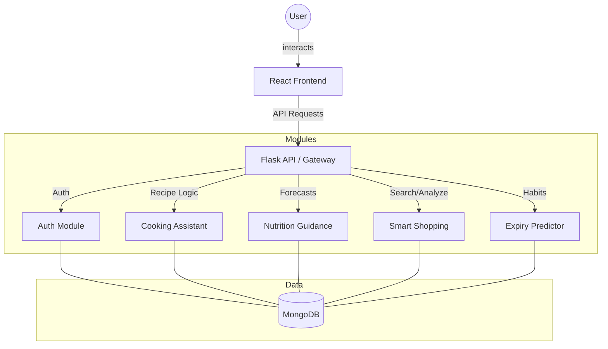

# AI-Powered Kitchen Ecosystem

The **AI-Powered Kitchen Ecosystem** is a comprehensive research initiative designed to address the global challenges of food waste and poor nutrition through an integrated, AI-driven platform. This holistic system seamlessly combines four specialized modules to support the entire food lifecycle, from planning and purchasing to cooking and consumption.

## 🛠️ Technical Stack

### Backend
- **Framework**: Flask (Python)
- **Database**: MongoDB (via Flask-PyMongo)
- **AI/ML**: Scikit-learn, Pandas, NumPy, Google Gemini (LLM Integration)
- **API Integration**: SERPAPI,DuckDuckgo Search, Beautiful Soup, multi-site product APIs
- **Security**: Flask-Bcrypt, Flask-JWT-Extended

### Frontend
- **Library**: React.js (Vite)
- **Styling**: Tailwind CSS, Framer Motion (for animations)
- **Icons**: Lucide React, React Icons
- **State Management**: React Context API

---

## 🧩 Core Modules

### 1. Spontaneous Cooking Assistant
Uses advanced computer vision and Retrieval-Augmented Generation (RAG) to identify available ingredients from images and suggest relevant, personalized recipes.

### 2. Behavioral Food Expiry Predictor
Learns from user consumption habits and historical data to deliver personalized spoilage alerts, significantly reducing domestic food waste.

### 3. AI Shopping Agent
Provides voice-enabled intelligent product search, cross-platform price comparisons, and AI-driven "Wastage Guidance" to ensure sustainable purchasing.

### 4. Nutritional Guidance & Predictive Health
Employs Machine Learning to forecast potential nutrient deficiencies based on consumption patterns and provides data-driven dietary interventions.

---

## 🏗️ System Architecture

The ecosystem follows a modular micro-services architecture where each unit interacts with a centralized MongoDB data store and a unified React frontend.

---

## 🚀 Installation & Setup

### Backend
1. Navigate to the `Backend` directory.
2. Create environment: `python -m venv .venv`
3. Activate: `.venv\Scripts\activate` (Windows)
4. Install dependencies: `pip install -r requirements.txt`
5. Run server: `python app.py`

### Frontend
1. Navigate to the `Frontend` directory.
2. Install dependencies: `npm install`
3. Run development server: `npm run dev`

## 📦 Key Dependencies
- **Backend**: `Flask`, `flask-pymongo`, `scikit-learn`, `google-generativeai`, `beautifulsoup4`
- **Frontend**: `react`, `react-router-dom`, `framer-motion`, `axios`, `tailwindcss`
